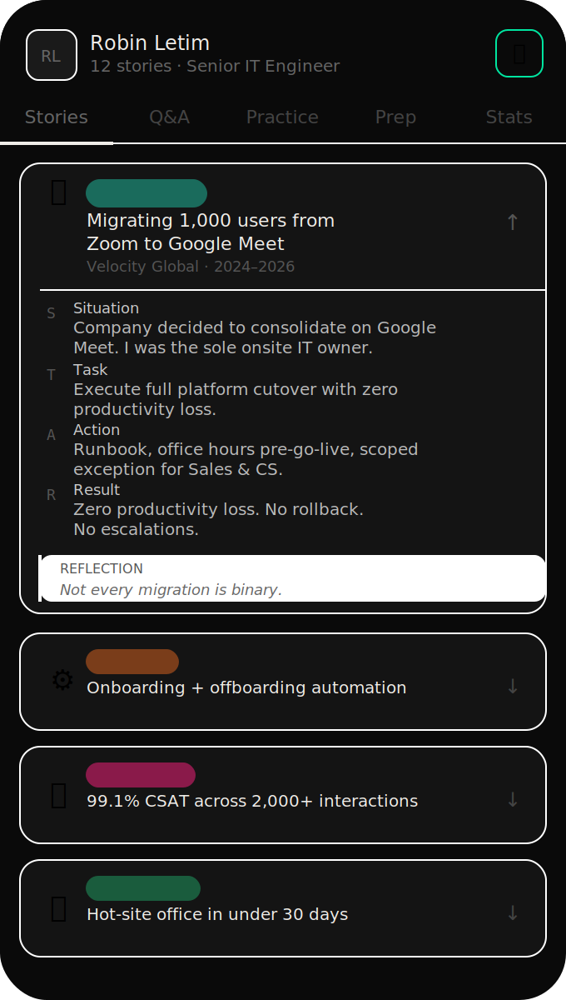
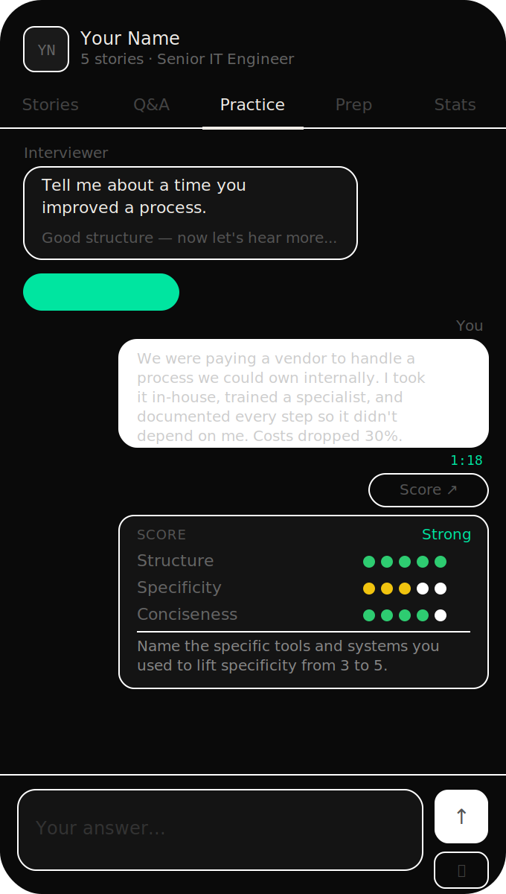
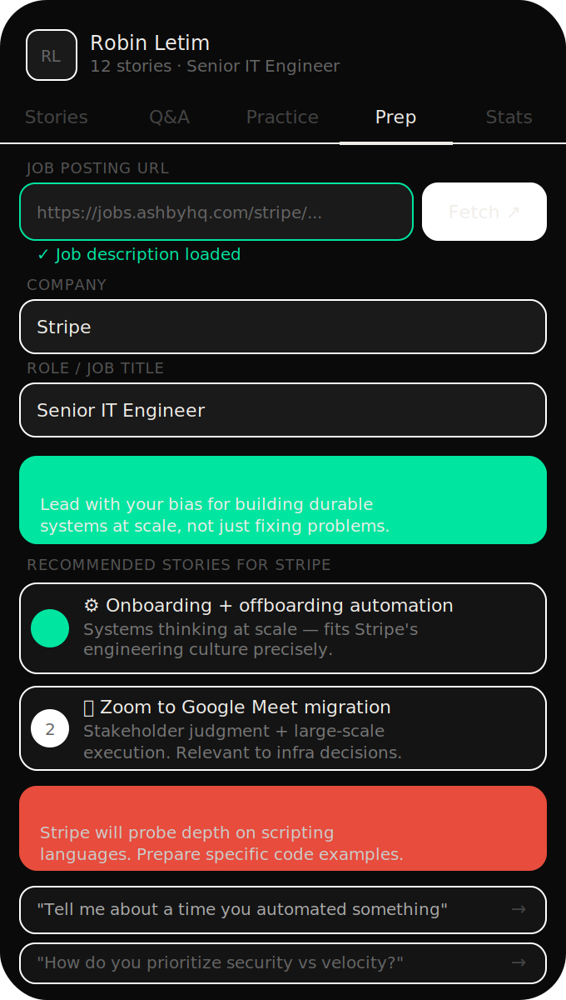
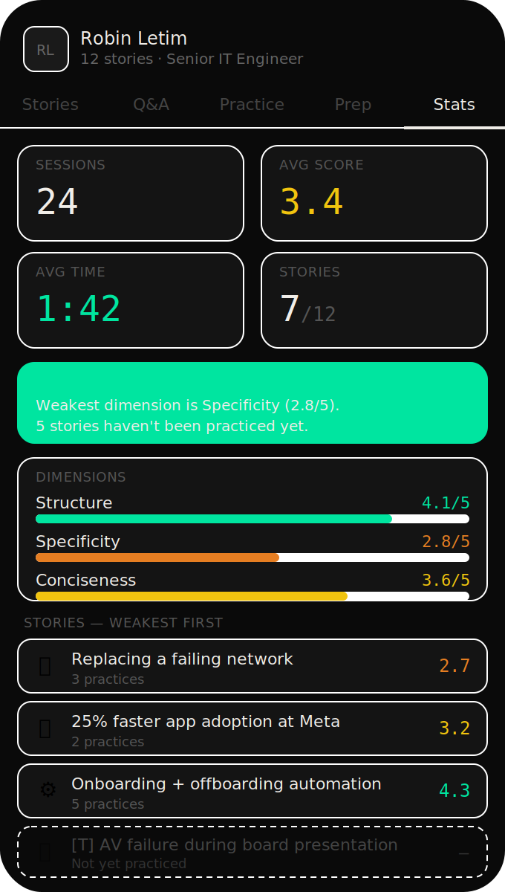

# Story Bank

An AI-powered interview prep app you can build in a weekend and run for the cost of a Claude subscription.

Built with React + TypeScript + Vite, deployed on Vercel, powered by the Anthropic API. Described in detail in [this Substack post](https://dawonderboy.substack.com/p/i-have-adhd-and-interviews-are-hard).

   

---

## What it does

Story Bank is a personal interview prep tool built around your own career stories, structured as STAR narratives. It replaces generic interview prep apps with something purpose-built for your specific experience and weaknesses.



**Stories** — Your career stories with full STAR breakdowns (Situation, Task, Action, Result) and a reflection on what each one demonstrates. Always in your pocket.

**Q&A mapper** — Common behavioral interview questions, each pre-mapped to the right story and why. No blanking on which story fits which question.



**Practice mode** — An AI interviewer asks the question, you answer (typed or by voice), it scores your answer on Structure, Specificity, and Conciseness (1–5 each) and fires a targeted follow-up probe. Cold open mode randomizes the question so you practice recall, not just repetition.

**Talk-time tracker** — A live timer that starts when you begin your answer. Green under 90 seconds, yellow approaching 2 minutes, red past it.

**Voice input** — Real-time transcription via Groq Whisper. Works in Chrome on iOS.



**Company prep tab** — Paste a job posting URL (Greenhouse, Lever, Workday, Ashby supported). The app fetches the JD, auto-fills company and role, and generates ranked story recommendations, likely interview questions, and positioning advice for that specific role.



**Stats dashboard** — Every scored session is saved to localStorage. Tracks average score per dimension, per story, and per session over time. Surfaces weak spots and unpracticed stories.

---

## Stack

| Layer | Tech |
|---|---|
| Frontend | React 18 + TypeScript + Vite |
| Styling | Inline styles with CSS variables |
| AI coaching | Anthropic API (`claude-sonnet-4-6`) |
| Voice transcription | Groq Whisper (`whisper-large-v3-turbo`) |
| Job posting fetch | Vercel serverless function (`/api/fetch-job`) |
| API proxies | Vercel serverless functions (`/api/claude`, `/api/groq`) |
| Deployment | Vercel |
| Persistence | Browser localStorage |

---

## Quick start

```bash
git clone https://github.com/dawonderboy/StoryBank-Template
cd StoryBank-Template
npm install
npm run dev
```

You'll need two API keys — both have free tiers:

| Key | Where to get it | Used for |
|---|---|---|
| Anthropic | [console.anthropic.com](https://console.anthropic.com) | AI coaching, scoring, company prep |
| Groq | [console.groq.com](https://console.groq.com) | Voice transcription |

Two ways to provide them:

1. **Recommended (zero-config) — set as Vercel environment variables**
   - `ANTHROPIC_API_KEY`
   - `GROQ_API_KEY`
   - The serverless functions read these on the server side, so users never enter keys in the browser.

2. **Per-browser — enter in the 🔑 dialog in the app header**
   - Stored in localStorage on that device only.
   - Useful for local dev or if you don't want to set Vercel env vars.

---

## Making it yours

All stories and Q&A mappings live in `src/App.tsx` as two arrays at the top of the file: `STORIES` and `QA`.

The template ships with 5 placeholder stories — replace them with your own:

```typescript
{
  id: "your-story-id",         // unique slug, no spaces
  cat: "Change Mgmt",          // category label
  emoji: "🔄",                 // pick one that fits
  title: "Short title of the story",
  src: "Company · Year–Year",
  S: "Situation — context and background",
  T: "Task — what you were responsible for",
  A: "Action — specifically what YOU did",
  R: "Result — measurable outcome",
  X: "Reflection — what it demonstrates about you",
  tags: ["tag1", "tag2", "tag3"]
}
```

Then update the `QA` array to map each question to your story ids:

```typescript
{
  q: "Tell me about a time you improved a process",
  lead: ["your-story-id"],       // primary story
  alt: ["another-story-id"],     // backup story
  note: "coaching note to yourself on why this story fits"
}
```

No database, no backend, no auth. The entire app is one file.

---

## Deploying to Vercel

```bash
npm run build
npx vercel --prod
```

Or connect your GitHub repo to Vercel for automatic deploys on push.

In your Vercel project settings, add these environment variables:

| Variable | Value |
|---|---|
| `ANTHROPIC_API_KEY` | your Anthropic key (starts with `sk-ant-`) |
| `GROQ_API_KEY` | your Groq key (starts with `gsk_`) |

Apply each to all three environments (Production, Preview, Development).

The three serverless functions in `/api/` handle:
- `claude.ts` — proxies Anthropic API calls (avoids CORS restrictions on direct browser calls)
- `groq.ts` — proxies Groq Whisper transcription
- `fetch-job.ts` — fetches job postings from ATS platforms (Greenhouse, Lever, Workday, Ashby)

---

## Adding it to your iPhone home screen

1. Open your Vercel URL in **Safari**
2. Tap the Share icon → **Add to Home Screen** → **Add**

It runs as a full-screen web app from your home screen.

---

## Project structure

```
/
├── src/
│   └── App.tsx          # entire frontend — stories, Q&A, all five tabs
├── api/
│   ├── claude.ts        # Anthropic API proxy
│   ├── groq.ts          # Groq Whisper proxy
│   └── fetch-job.ts     # ATS job posting fetcher
├── screenshots/         # README assets
├── index.html
├── vite.config.ts
└── package.json
```

---

## Why I built this

I have ADHD. Interview prep is hard when retention is unreliable, sitting down to practice takes activation energy you don't always have, and rambling is your default mode under pressure.

Existing tools were too generic, too expensive, or required too much setup to actually use consistently. So I built something purpose-built for my specific stories, my specific weaknesses, and the way my brain works.

Full writeup: [I Have ADHD and Interviews Are Hard. So I Built a Tool That Works With My Brain.](https://dawonderboy.substack.com/p/i-have-adhd-and-interviews-are-hard)

---

## License

MIT — fork it, adapt it, make it yours.

---

*Built by [Robin Letim](https://github.com/dawonderboy) · [Substack](https://dawonderboy.substack.com)*
